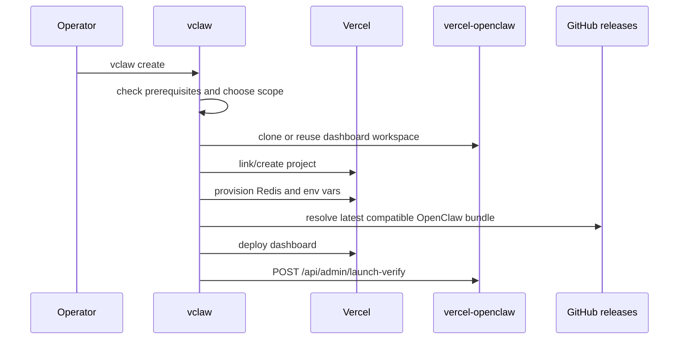
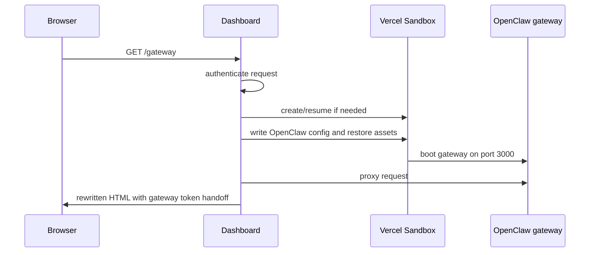
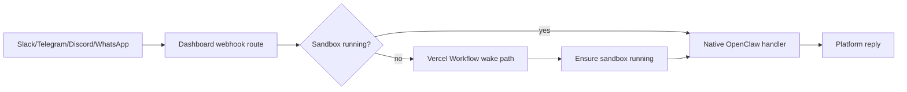

# Operational Paths

These are the end-to-end flows a maintainer should understand before changing setup, lifecycle, proxy, or channel behavior.

## Create And Deploy

The supported install path is `vclaw create` because it owns the full chain: local prereqs, Vercel project setup, Redis, env vars, deployment protection, deploy, launch verification, and optional channel connection.

Key sources live in the `vclaw` repository: `src/commands/create.mjs`, `src/steps/bundle.mjs`, `src/steps/env.mjs`, `src/steps/deploy.mjs`, and `src/steps/run-verify.mjs`.

## Sandbox Boot And Proxy

The dashboard authenticates before proxying HTML, manages the sandbox lifecycle, writes OpenClaw config, and rewrites proxied HTML for WebSocket routing plus gateway-token handoff. See [Sandbox Lifecycle and Restore](../lifecycle-and-restore.md), [Architecture](../architecture.md), and [Deployment Protection](../deployment-protection.md) for the deeper model.

## Channel Delivery

Channel incidents are layered. Separate these states in reports and code: OAuth/config complete, credentials saved, config sync applied, handler registered, route ready, native forward accepted, and user-visible reply.

The Workflow wake path forwards the original platform payload to OpenClaw's native channel handler after the sandbox is ready. Do not treat it as a generic chat-completions fallback when debugging delivery.

For stuck delivery, start from live evidence: `GET /api/admin/why-not-ready`, `GET /api/channels/summary`, `GET /api/admin/sandbox-diag`, and `GET /api/admin/logs`. Use [Channels and Webhooks](../channels-and-webhooks.md) and the channel-debug instructions in `CLAUDE.md`/`AGENTS.md` before proposing fixes.

## Verification Boundaries

- A deployed dashboard URL does not prove the sandbox can boot or complete chat.
- Preflight passing does not prove channel-ready delivery.
- Destructive launch verification proves runtime channel readiness, not external platform delivery. A real Slack, Telegram, Discord, or WhatsApp test message is still required after channel setup.
- `lastForward.ok:true` proves native acceptance, not necessarily a human-visible reply.
- Passing CI does not prove a protected deployment can receive external webhooks.
