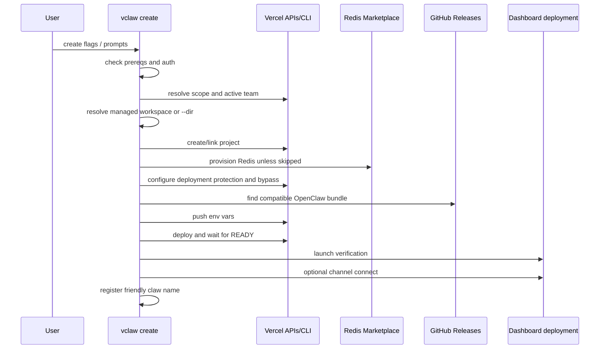

# vclaw Create

`vclaw create` is the supported install path because it controls provisioning through live launch verification instead of stopping at a deployed project.

## Sequence

## Important Flags

- `--scope` chooses the Vercel owner.
- `--name` chooses the Vercel project name.
- `--claw-name` writes the local friendly registry alias after successful verification.
- `--admin-secret` is required non-interactively.
- `--deployment-protection` can be `none`, `sso`, or `password`.
- `--protection-bypass-secret` supplies or overrides the automation bypass secret.
- `--bundle-url` pins an OpenClaw bundle URL.
- `--no-bundle` skips automatic bundle discovery.
- `--dir` uses an existing local `vercel-openclaw` checkout unless paired with `--clone`.
- `--clone` clones or updates `vercel-openclaw` into `--dir` or the managed workspace.
- `--skip-clone` prevents clone/update when using the managed/default path.
- `--skip-redis` assumes Redis is already provisioned.
- `--skip-deploy` stops before live verification and cannot be combined with channel flags.
- `--telegram` connects a Telegram bot after verification.
- Slack supports app creation with `--slack-config-token` or existing-app connection with `--slack-bot-token` plus `--slack-signing-secret`.

For the current flag surface, use `vclaw create --help` and the `vclaw` source in `src/commands/create.mjs`. The command source is the authority for validation rules.

## Non-Interactive Runs

Promptless create flows usually need `--scope`, `--name`, `--claw-name`, `--admin-secret`, and `--yes`.

For non-interactive Slack setup, use one of these flows:

- New app: `--slack-config-token <token>` with optional `--slack-app-name <name>`.
- Existing app: `--slack-bot-token <xoxb-token> --slack-signing-secret <secret>`.

`--slack` by itself selects the interactive Slack setup menu.

Be careful with shell expansion. `VAR=value vclaw create --slack-config-token "$VAR"` expands `$VAR` before the temporary assignment applies, so the flag can be empty. Export the variable first or pass the literal value.

## Failure Boundaries

- Invalid Vercel auth should fail before later provisioning prompts.
- Deployment must reach READY before verification.
- Launch verification failure means the app may exist but is not operational.
- Explicit channel flags are requested outcomes. Telegram failures and invalid Slack credentials should fail or return a concrete recovery path. Slack has one deliberate degraded-success case: if credentials are saved and `auth.test` passes but `deliveryReady` or `routeReady` are still propagating, `vclaw create` warns and continues unless `VCLAW_STRICT_SLACK_DELIVERY=1` is set. Re-run `vclaw verify` or send a real Slack message to confirm delivery.
- The local claw registry write is intentionally deferred until deploy, verify, and requested channel setup succeed.
- Partial create failures with a real workspace/deployment usually recover through `vclaw doctor --workspace <path> --url <verify-url> --launch-verify` plus `vclaw verify`, not by deleting everything.

## Bundle Resolution

`vclaw` resolves an OpenClaw release that contains the full sandbox sidecar set, not just `openclaw.bundle.mjs`. In local development, the resolver defaults to `~/dev/openclaw` unless `OPENCLAW_REPO_DIR` is set, so stale remotes or local branch surprises can affect release selection.
